# Lab 07 — Defender for Office 365

**Status:** Complete

## Overview

Reviews Microsoft 365 email-protection controls and investigates the earlier alias-delivery failure across Defender Explorer, Email Entity, and Exchange Message Trace.

## Scenario

An Exchange alias test had failed even though no malicious message was expected. The security task was to determine whether Defender had detected a threat or whether the failure belonged to normal mail flow.

## Objectives

- Review the main Defender for Office 365 protection policies.
- Inspect built-in Safe Attachments and Safe Links protection.
- Review anti-phishing, anti-spam, and anti-malware configuration.
- Investigate the failed alias message in Defender.
- Correlate Defender findings with Exchange Message Trace.
- Establish a clean alerts/incidents/quarantine baseline.

## Tools and Services Used

- Microsoft Defender portal
- Defender Explorer
- Email Entity
- Exchange Message Trace
- Defender for Office 365

## Administrative Workflow

The portal procedures below reflect the navigation used during this lab. Microsoft occasionally changes portal labels or menu placement, but the administrative sequence and validation points remain the same.

### Step 1 — Review the email security policy surface

Threat policies were reviewed first to understand the protection already active in the tenant.

<strong>Portal procedure</strong>

**Navigation:** Microsoft Defender portal → Email & collaboration → Policies & rules → Threat policies

1. Open the Microsoft Defender portal.
2. Go to **Email & collaboration → Policies & rules → Threat policies**.
3. Review the available anti-phishing, anti-spam, anti-malware, Safe Attachments, Safe Links, and preset-security policy areas.
4. Record which protections are already enabled before making any change.

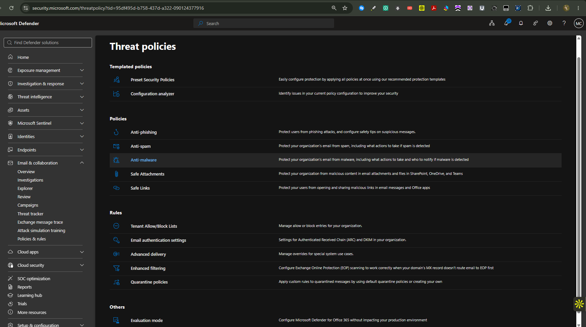

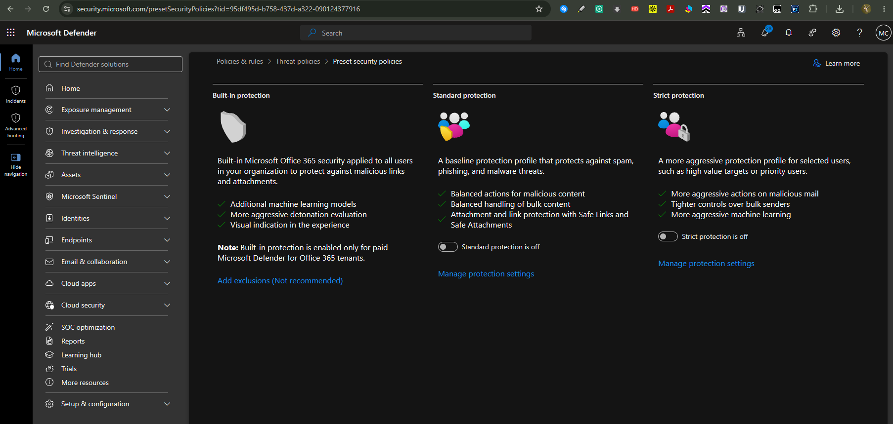

### Step 2 — Review anti-phishing protection

The default anti-phishing policy and related policy list were inspected, including mailbox/spoof intelligence behavior.

<strong>Portal procedure</strong>

**Navigation:** Microsoft Defender portal → Email & collaboration → Policies & rules → Threat policies → Anti-phishing

1. Open **Anti-phishing**.
2. Open the default anti-phishing policy.
3. Review the phishing threshold and intelligence settings.
4. Review mailbox intelligence, spoof intelligence, and DMARC-handling behavior.
5. Leave the default policy unchanged unless a specific project requirement justifies a change.

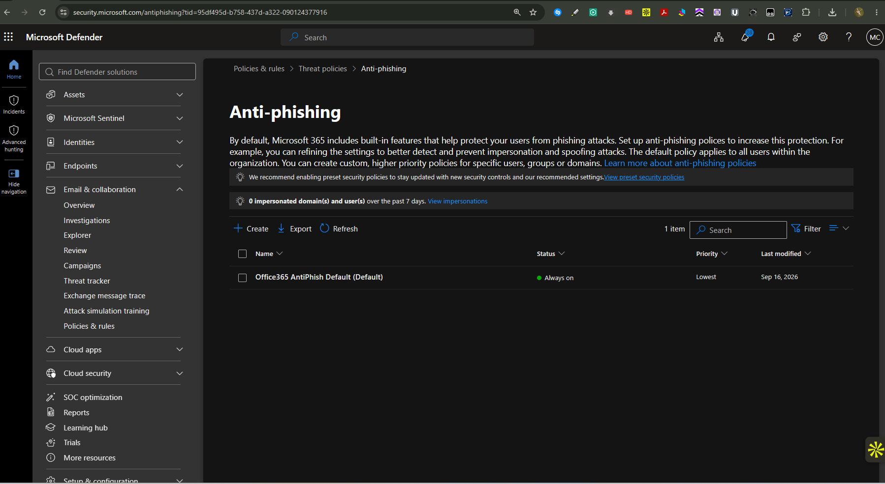

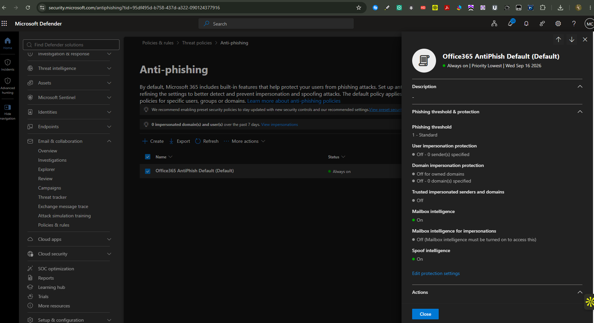

### Step 3 — Review spam and malware protection

Inbound/outbound spam and anti-malware settings were reviewed without creating unnecessary duplicate policies.

<strong>Portal procedure</strong>

**Navigation:** Microsoft Defender portal → Threat policies → Anti-spam / Anti-malware

1. Open **Anti-spam** and review both inbound and outbound default policies.
2. Review recipient/sender limits and automatic-forwarding behavior.
3. Open **Anti-malware**.
4. Review common attachment filtering and Zero-hour auto purge behavior.
5. Document the existing protection rather than duplicating it with unnecessary custom policies.

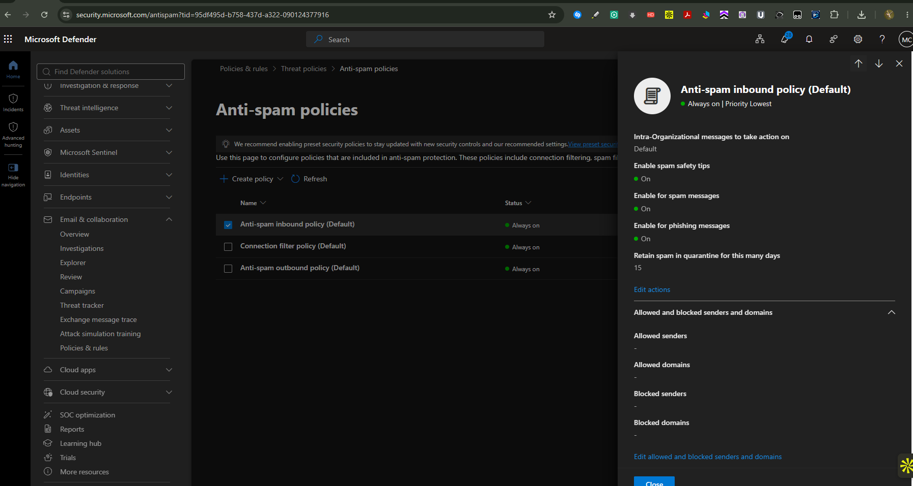

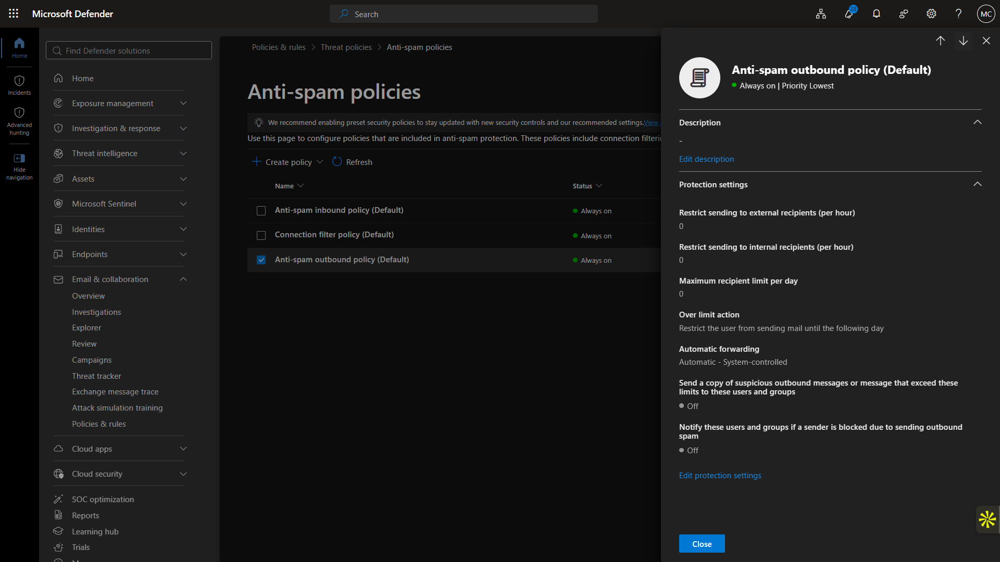

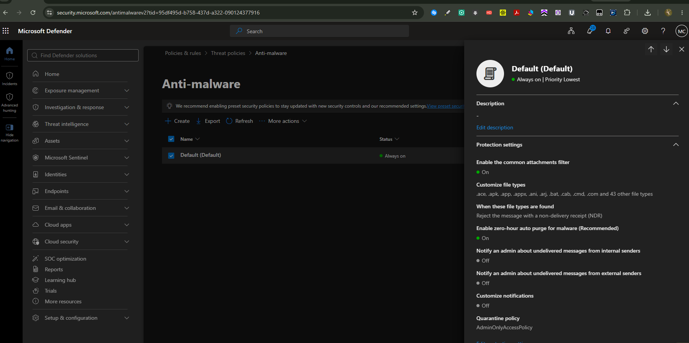

### Step 4 — Review Safe Attachments and Safe Links

The built-in Safe Attachments and Safe Links protections were inspected as part of the email-security baseline.

<strong>Portal procedure</strong>

**Navigation:** Microsoft Defender portal → Threat policies → Safe Attachments / Safe Links

1. Open **Safe Attachments** and review the built-in protection state.
2. Open **Safe Links** and review the built-in protection state.
3. Confirm that the protections are enabled at the level available in the tenant.
4. Do not add duplicate policies solely for portfolio evidence.

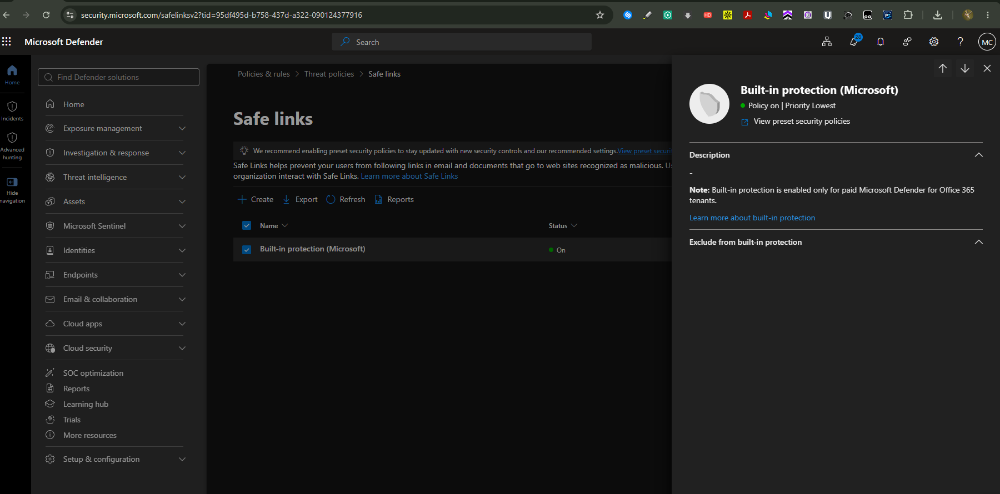

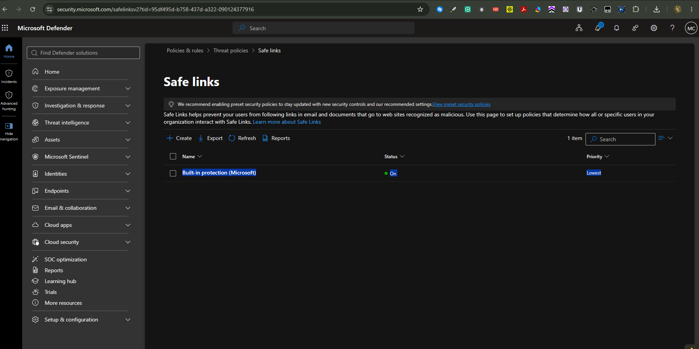

### Step 5 — Investigate the failed alias message

The alias test was opened in Explorer and Email Entity. The threat verdict remained `None`, indicating that Defender had not classified the message as malware or phishing.

<strong>Portal procedure</strong>

**Navigation:** Microsoft Defender portal → Email & collaboration → Explorer → select message → Email Entity

1. Open **Explorer**.
2. Search for the failed alias test by time, sender, recipient, or subject.
3. Open the message details.
4. Review the threat verdict, delivery information, detections, and timeline.
5. Open **Email Entity** for the same message.
6. Confirm that Defender reports no malware or phishing verdict for the failed test.

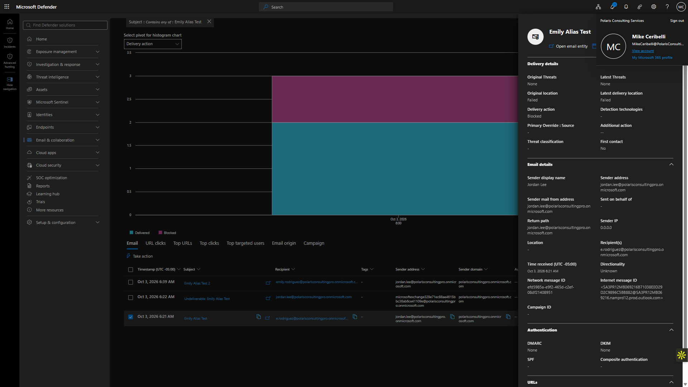

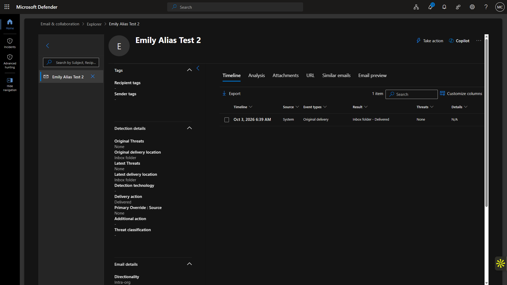

### Step 6 — Correlate with Exchange delivery evidence

Exchange Message Trace was used alongside Defender to confirm that the earlier failure was a delivery problem rather than a security detection.

<strong>Portal procedure</strong>

**Navigation:** Exchange admin center → Mail flow → Message trace

1. Open Exchange admin center in a separate tab.
2. Go to **Mail flow → Message trace**.
3. Locate the same failed alias test.
4. Compare the trace delivery status with the Defender threat verdict.
5. Repeat the comparison for the successful retest.
6. Use both services to distinguish security verdict from delivery result.

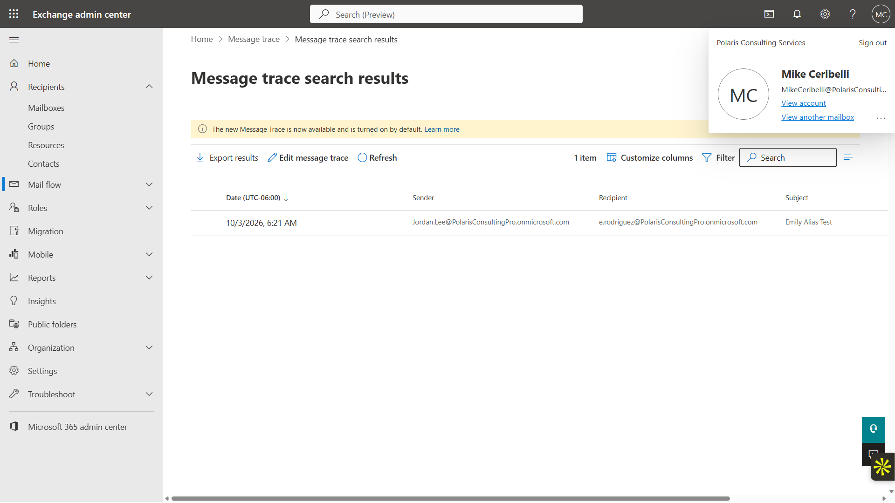

### Step 7 — Review the operational security baseline

Incidents, quarantine, reports, and Configuration Analyzer were reviewed to establish the final state and identify remaining configuration opportunities such as DKIM.

<strong>Portal procedure</strong>

**Navigation:** Microsoft Defender portal → Incidents & alerts / Quarantine / Reports / Configuration Analyzer

1. Open **Incidents & alerts** and review the current incident/alert state.
2. Open **Quarantine** and review the current message baseline.
3. Open **Reports → Email & collaboration** for available protection reporting.
4. Open **Configuration Analyzer**.
5. Review recommended configuration improvements such as the DKIM item.
6. Record gaps for follow-up rather than changing unrelated settings during the investigation.

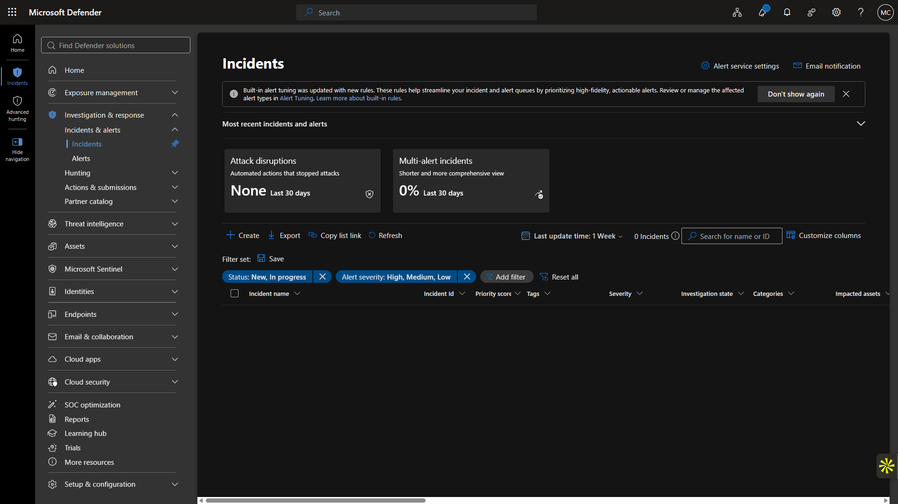

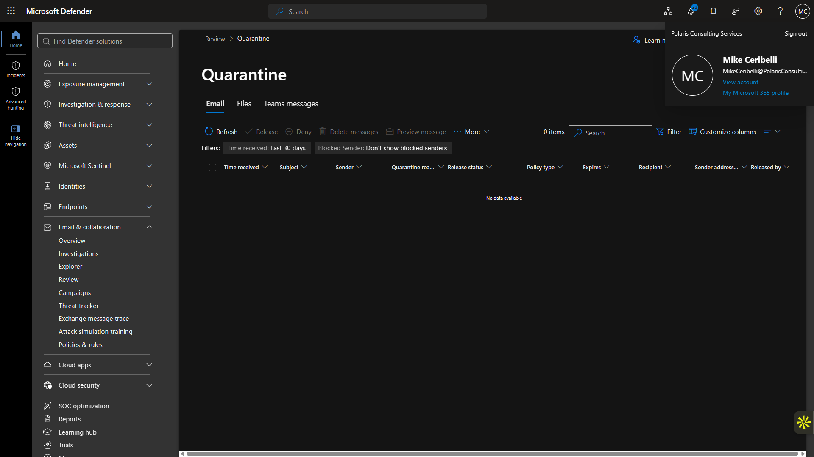

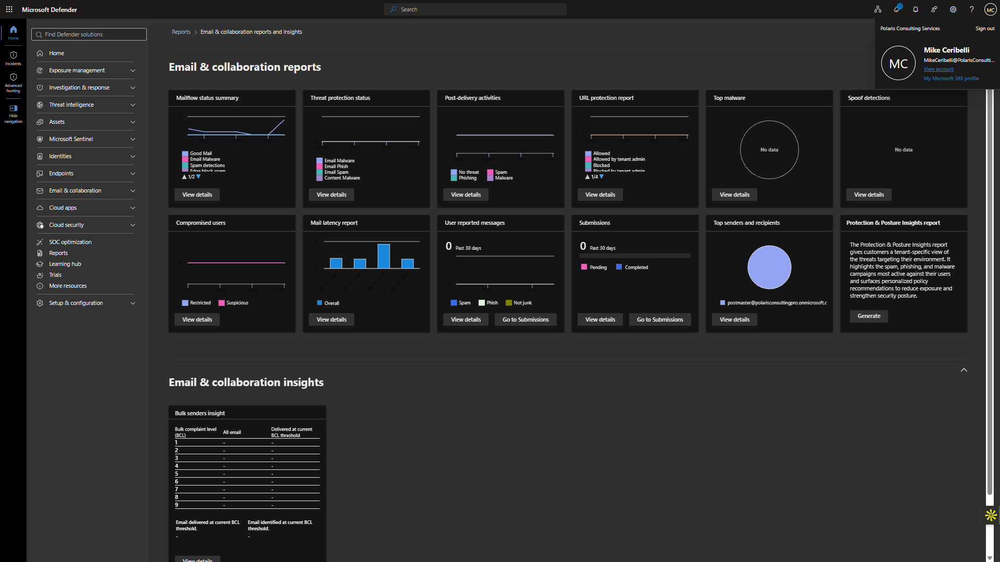

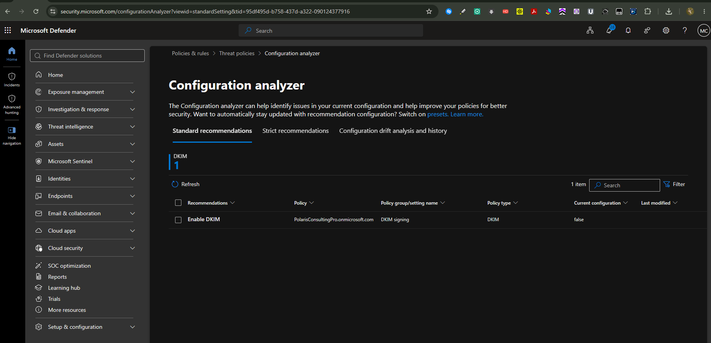

## Expected Outcome

Existing protection remains enabled, the alias failure is correctly classified as a mail-flow problem, and the tenant's alerting surfaces show a clean baseline.

## Validation

- Anti-phishing, anti-spam, anti-malware, Safe Attachments, and Safe Links reviewed.
- Failed alias message showed threat verdict `None`.
- Exchange Message Trace confirmed the delivery failure independently of Defender.
- Successful retest remained non-malicious.
- Incidents and quarantine showed no relevant threat event.

## Security Considerations

- No protection setting was weakened to simplify the investigation.
- No attack simulation or malicious payload was introduced.
- DKIM was documented as an improvement opportunity and addressed later in a dedicated email-authentication lab.

## Common Issues and Troubleshooting

The key troubleshooting decision was to separate delivery status from threat verdict. A blocked or failed message can be caused by mail-flow conditions even when Defender reports no malicious verdict.

## Key Takeaways

- Email investigations are stronger when Defender evidence is correlated with Exchange delivery data.
- A failed message is not automatically a security incident.
- Security policy review should distinguish between controls that already exist and configuration gaps that still require action.
