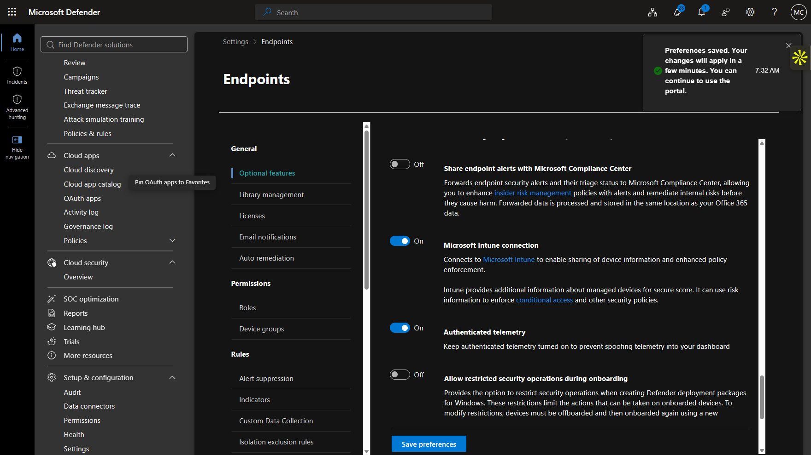
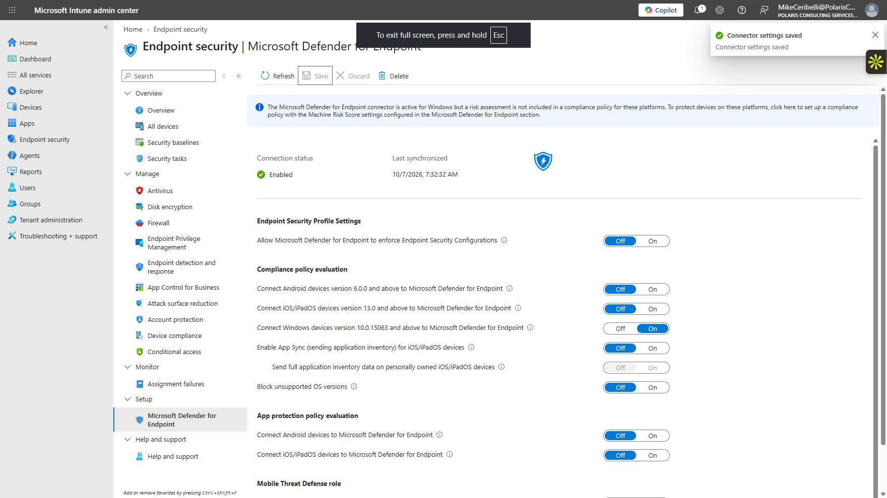
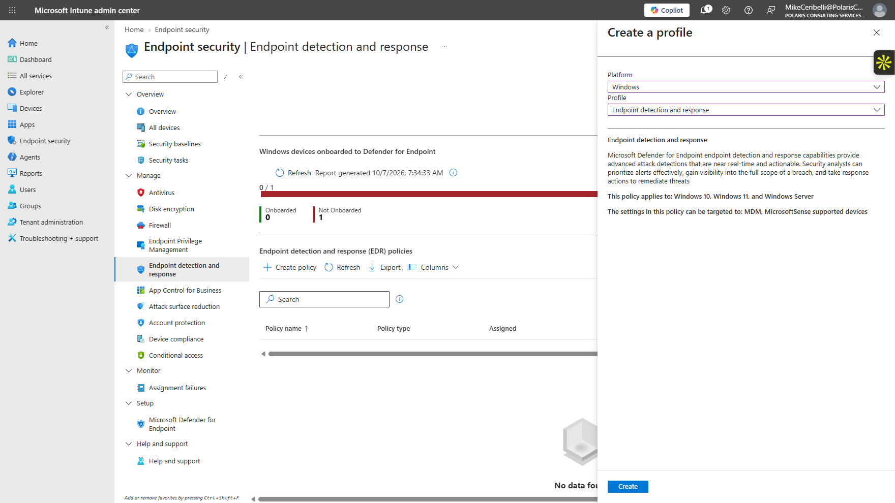
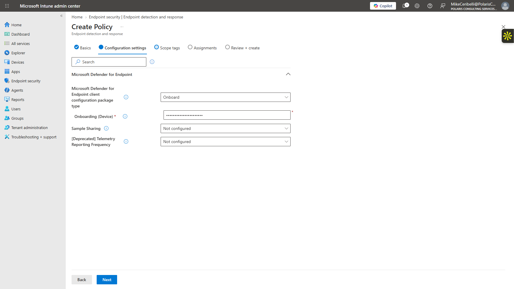
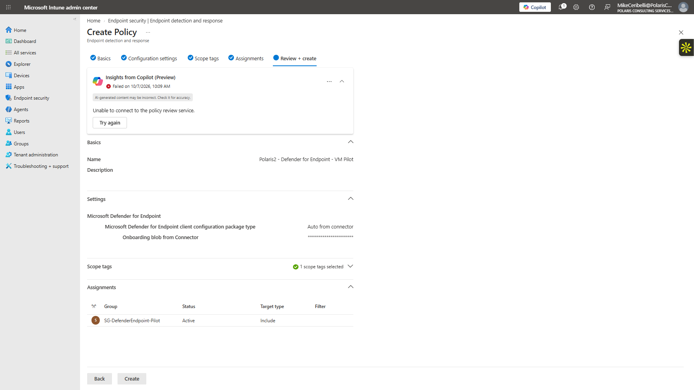
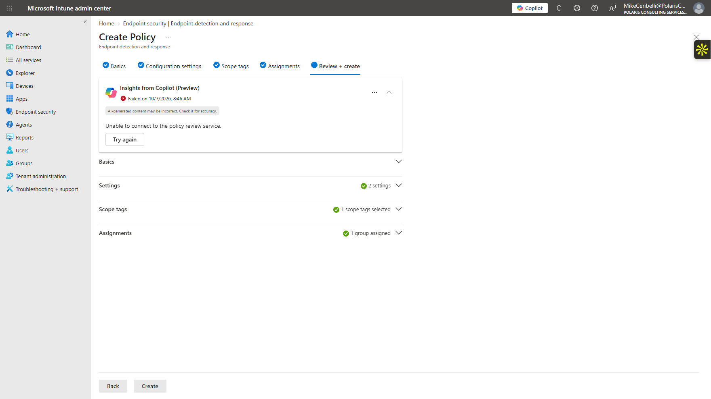
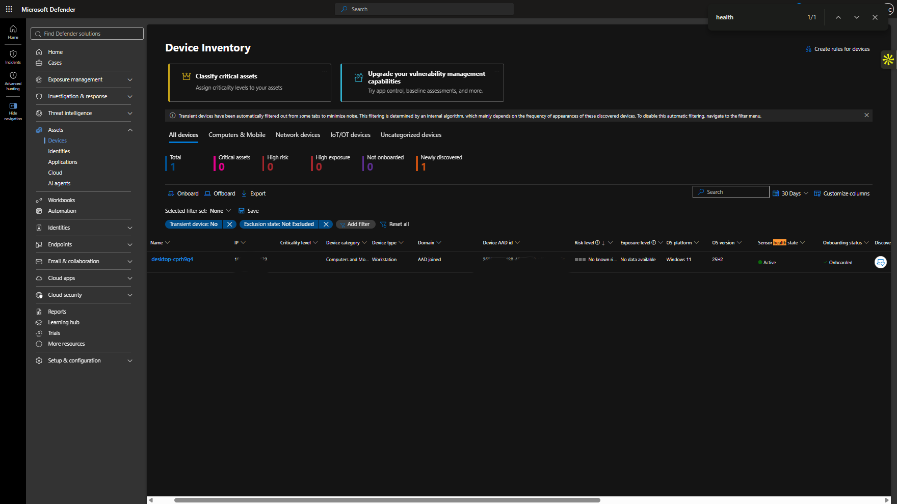
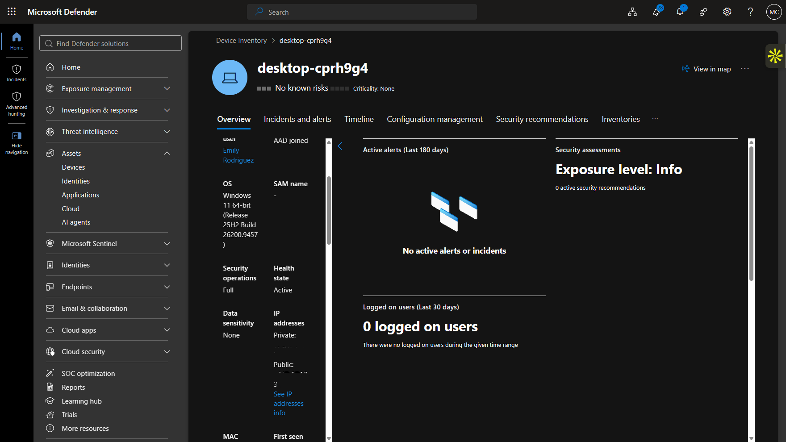
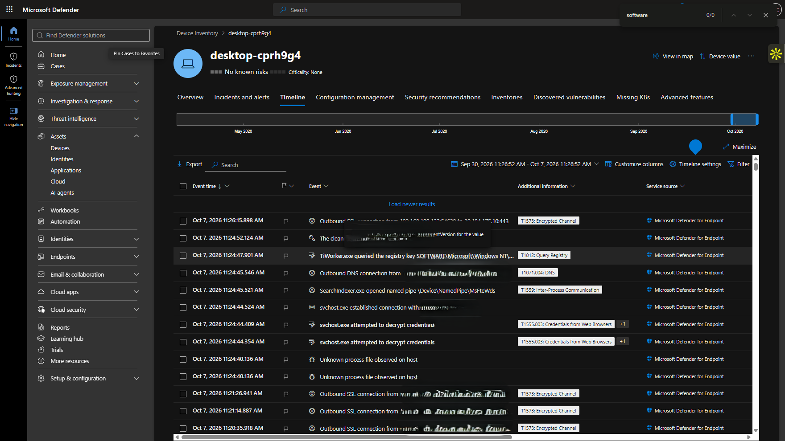

# Lab 16 — Microsoft Defender for Endpoint

**Status:** Complete

## Overview

Onboards the managed Windows VM to Defender for Endpoint through Intune and validates device inventory, active sensor state, security posture, and endpoint telemetry.

## Scenario

The existing Windows VM was already Entra joined, Intune managed, and compliant. The next step was to extend that endpoint lifecycle into Defender for Endpoint without onboarding the physical host.

## Objectives

- Verify the Intune / Defender connector.
- Create a pilot-scoped EDR onboarding policy.
- Onboard only the managed Windows VM.
- Confirm the device appears in Defender Device Inventory.
- Validate active sensor and antivirus state.
- Review the endpoint timeline for real telemetry.

## Tools and Services Used

- Microsoft Defender portal
- Microsoft Defender for Endpoint
- Microsoft Intune
- Endpoint detection and response policy
- Windows Defender Antivirus

## Administrative Workflow

The portal procedures below reflect the navigation used during this lab. Microsoft occasionally changes portal labels or menu placement, but the administrative sequence and validation points remain the same.

### Step 1 — Enable and verify the Intune / Defender integration

The connector was enabled and reviewed before the endpoint onboarding policy was assigned.

<strong>Portal procedure</strong>

**Navigation:** Microsoft Intune admin center → Endpoint security → Microsoft Defender for Endpoint

1. Open the Intune admin center.
2. Go to **Endpoint security → Microsoft Defender for Endpoint**.
3. Review the connection state.
4. Enable the supported integration/connector settings required for endpoint onboarding.
5. Save the configuration.
6. Refresh and confirm the connector reports a healthy/enabled state.

### Step 2 — Create the EDR onboarding profile

An endpoint detection and response profile was created using automatic onboarding from the connector.

<strong>Portal procedure</strong>

**Navigation:** Microsoft Intune admin center → Endpoint security → Endpoint detection and response → Create policy

1. Open **Endpoint security → Endpoint detection and response**.
2. Select **Create policy**.
3. Choose the Windows platform/profile supported by the tenant.
4. Name the policy for the Defender pilot.
5. Set the onboarding package source to the automatic connector-based option.
6. Review the settings before assignment.

### Step 3 — Assign the policy to the pilot endpoint

The EDR policy was assigned narrowly to the managed VM rather than to all devices.

<strong>Portal procedure</strong>

**Navigation:** Microsoft Intune admin center → EDR policy → Assignments

1. Open the new EDR onboarding policy.
2. Open **Assignments**.
3. Target the dedicated Defender pilot group/device scope.
4. Avoid assigning the profile to all devices.
5. Save the assignment.
6. Review deployment status after the managed VM checks in.

### Step 4 — Confirm device inventory and onboarding

The VM appeared in Defender Device Inventory with an onboarded and active state.

<strong>Portal procedure</strong>

**Navigation:** Microsoft Defender portal → Assets → Devices

1. Open the Microsoft Defender portal.
2. Go to **Assets → Devices** or the current Device Inventory view.
3. Search for `DESKTOP-CPRH9G4`.
4. Open the device record.
5. Confirm the onboarding state and active health/sensor state.

### Step 5 — Review the endpoint security posture

The device overview showed active health, Defender Antivirus, real-time protection, and no known risks.

<strong>Portal procedure</strong>

**Navigation:** Microsoft Defender portal → Device page → Overview / Security recommendations

1. Review the device overview.
2. Confirm Defender Antivirus and real-time protection are enabled.
3. Review the risk and exposure state.
4. Open security recommendations and confirm the current recommendation count for the endpoint.
5. Avoid changing security posture merely to generate a detection.

### Step 6 — Validate endpoint telemetry

The Device Timeline populated with live endpoint events, confirming that the sensor was reporting to Defender.

<strong>Portal procedure</strong>

**Navigation:** Microsoft Defender portal → Device page → Timeline

1. Open the device's **Timeline**.
2. Verify that endpoint events are populating.
3. Review representative process/network/security events.
4. Confirm timestamps and source information show active telemetry from Microsoft Defender for Endpoint.
5. Use the populated timeline as evidence that the sensor is reporting.

## Expected Outcome

The managed Windows VM is onboarded into Defender for Endpoint, reports an active sensor state, and generates endpoint telemetry without involving the physical workstation.

## Validation

- Intune / Defender integration enabled and healthy.
- EDR onboarding profile created and assigned.
- VM visible in Defender Device Inventory.
- Onboarding state reported Onboarded.
- Sensor/health state reported Active.
- Defender Antivirus and real-time protection enabled.
- Device Timeline populated with telemetry.

## Security Considerations

- Only the disposable VM was targeted for onboarding.
- The physical host remained outside the Defender pilot.
- No malware, exploit, or unsafe payload was introduced to force an alert.
- IP/device identifiers in public screenshots were redacted where appropriate.

## Common Issues and Troubleshooting

A synthetic web-based detection test was considered, but localhost TCP 80 was not listening. Rather than install a web server or weaken the endpoint simply to force an alert, the lab stopped after the onboarding and live telemetry goals were already satisfied.

## Key Takeaways

- Endpoint onboarding is validated by more than a policy assignment; inventory, health state, sensor activity, and telemetry provide stronger evidence.
- Intune can provide a clean onboarding path into Defender for Endpoint for a narrowly scoped pilot device.
- Security validation should not weaken the endpoint just to manufacture a detection.
