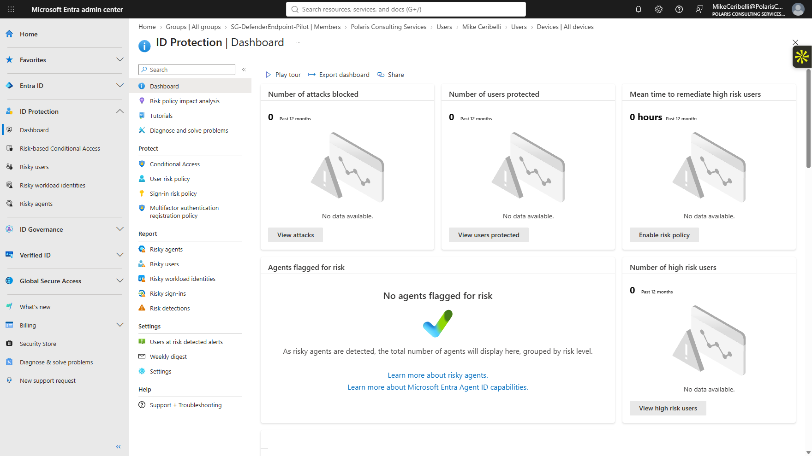
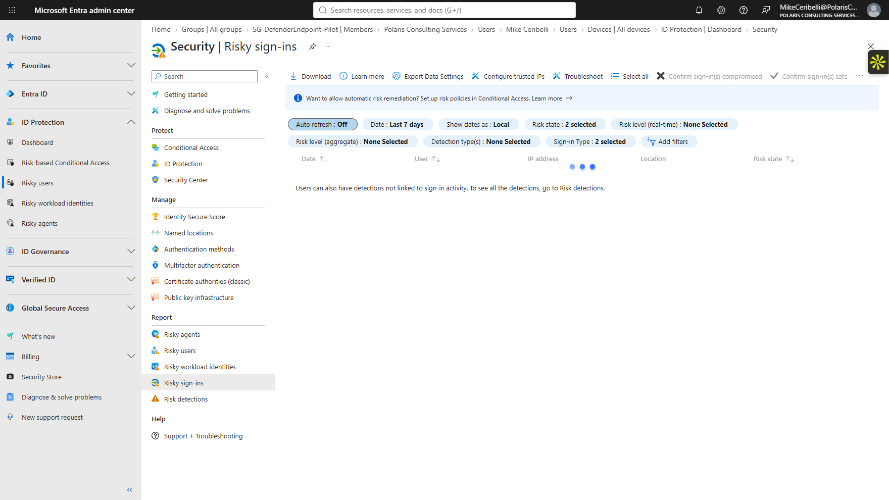
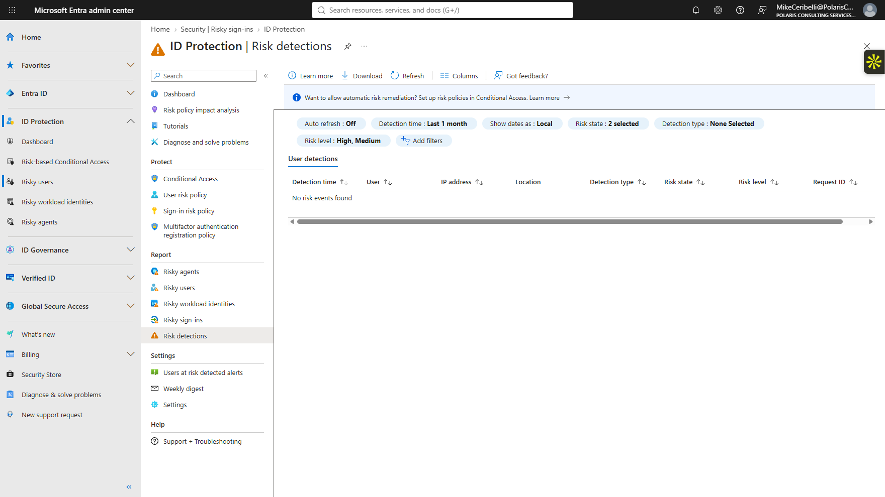
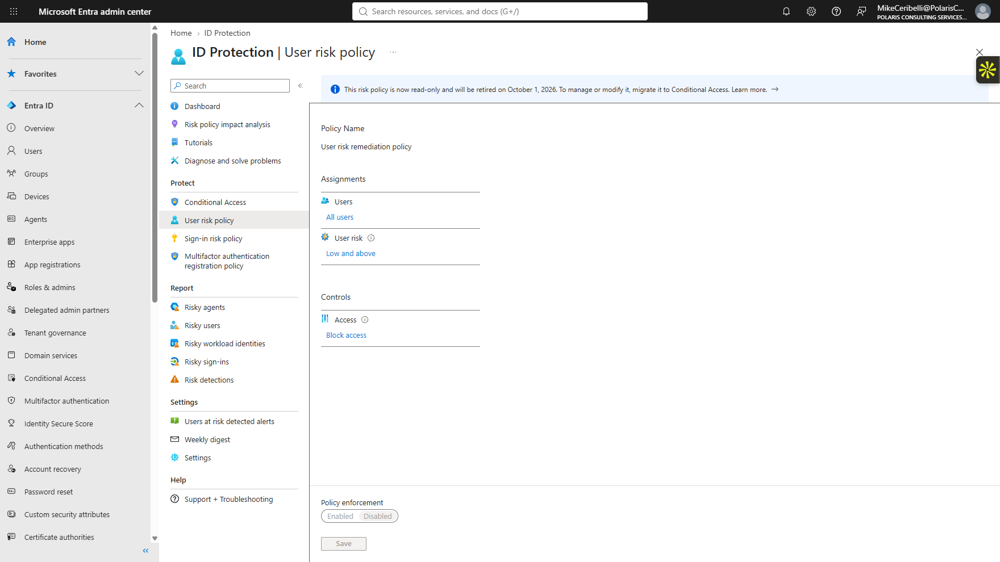
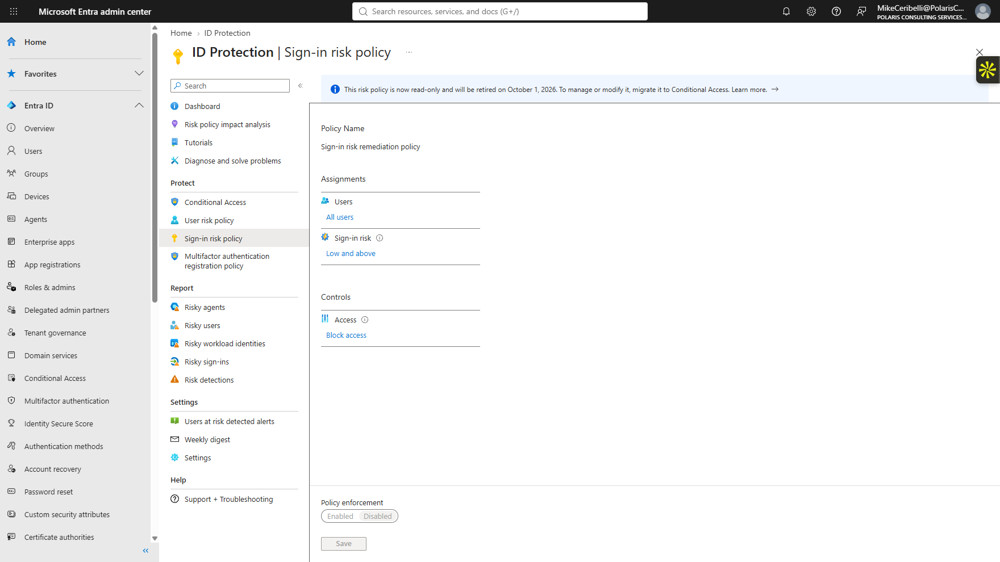
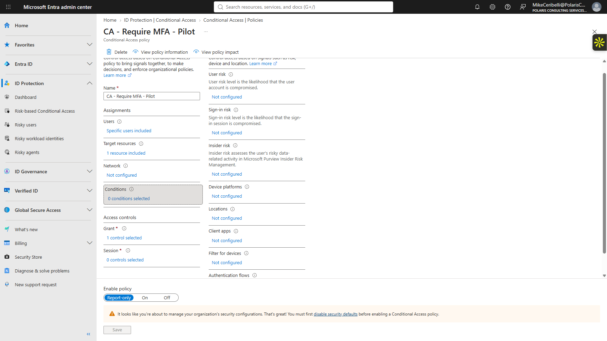

# Lab 17 — Microsoft Entra Identity Protection

**Status:** Complete

## Overview

Reviews risky users, risky sign-ins, risk detections, and the modern relationship between identity-risk signals and Conditional Access.

## Scenario

The tenant had no known risky identities. The objective was to inspect the available risk surfaces, establish the baseline, and document how modern risk remediation is handled without generating artificial suspicious activity.

## Objectives

- Review the Identity Protection dashboard.
- Inspect risky users, risky sign-ins, and risk detections.
- Review the legacy user-risk and sign-in-risk policy pages.
- Inspect risk conditions in the existing Conditional Access pilot.
- Preserve the tenant's clean risk baseline.

## Tools and Services Used

- Microsoft Entra admin center
- Identity Protection
- Risky Users
- Risky Sign-ins
- Risk Detections
- Conditional Access

## Administrative Workflow

The portal procedures below reflect the navigation used during this lab. Microsoft occasionally changes portal labels or menu placement, but the administrative sequence and validation points remain the same.

### Step 1 — Review the Identity Protection baseline

The Identity Protection dashboard showed no current risky-user population.

<strong>Portal procedure</strong>

**Navigation:** Microsoft Entra admin center → Protection → Identity Protection → Overview / Risky users

1. Open **Protection → Identity Protection**.
2. Review the overview dashboard.
3. Open **Risky users**.
4. Confirm that there are no current risky-user records.
5. Record the clean baseline without generating synthetic risk.

### Step 2 — Review risky sign-ins and detections

Risky sign-ins and risk detections were reviewed without generating synthetic suspicious activity.

<strong>Portal procedure</strong>

**Navigation:** Microsoft Entra admin center → Protection → Identity Protection → Risky sign-ins / Risk detections

1. Open **Risky sign-ins** and review the current results.
2. Review available filters such as risk state, real-time risk, aggregate risk, and sign-in type.
3. Open **Risk detections**.
4. Confirm that no current risk events are present.
5. Leave remediation actions untouched because there is no risky identity to remediate.

### Step 3 — Review the retired user-risk policy

The legacy user-risk remediation policy was read-only and marked as retired, directing administration toward Conditional Access.

<strong>Portal procedure</strong>

**Navigation:** Microsoft Entra admin center → Protection → Identity Protection → User risk policy

1. Open the legacy **User risk** policy page.
2. Review its configured scope, risk threshold, and access action.
3. Confirm the policy is read-only/disabled and marked as retired.
4. Note that current risk-based enforcement is managed through Conditional Access.

### Step 4 — Review the retired sign-in-risk policy

The corresponding legacy sign-in-risk policy was also read-only and retired.

<strong>Portal procedure</strong>

**Navigation:** Microsoft Entra admin center → Protection → Identity Protection → Sign-in risk policy

1. Open the legacy **Sign-in risk** policy page.
2. Review the users, risk threshold, and access action shown.
3. Confirm that the policy is read-only/disabled and retired.
4. Use the page as historical/context evidence rather than attempting to enable it.

### Step 5 — Review Conditional Access risk conditions

The existing MFA pilot was inspected and confirmed not to use User risk or Sign-in risk conditions.

<strong>Portal procedure</strong>

**Navigation:** Microsoft Entra admin center → Protection → Conditional Access → CA - Require MFA - Pilot → Conditions

1. Open the existing `CA - Require MFA - Pilot` policy.
2. Review **Conditions**.
3. Confirm **User risk** is not configured.
4. Confirm **Sign-in risk** is not configured.
5. Review the remaining condition categories.
6. Leave the policy in its existing report-only state.

## Expected Outcome

The tenant's clean identity-risk baseline is documented and the modern Conditional Access path for risk-based controls is clearly identified.

## Validation

- Risky users: 0.
- Risky sign-ins: 0.
- Risk detections: 0.
- Legacy user-risk and sign-in-risk policies shown as retired/read-only.
- Current Conditional Access pilot had risk conditions not configured.
- No remediation or risk policy change was performed.

## Security Considerations

- No suspicious sign-in or risky-user condition was manufactured for the sake of evidence.
- Security Defaults and the existing Conditional Access pilot remained unchanged.
- No extra role or security product trial was added.

## Key Takeaways

- Risky user, risky sign-in, and risk detection represent different levels of identity-risk information.
- Modern identity-risk enforcement is designed to feed Conditional Access rather than the retired standalone risk policies.
- A clean risk baseline is still useful operational evidence when it is documented honestly and tied to the available remediation path.
