# Lab 18 — Microsoft Secure Score

**Status:** Complete

## Overview

Uses Secure Score as a structured review of the tenant's existing controls, completed recommendations, and remaining improvement opportunities.

## Scenario

After the implementation labs were complete, Secure Score was used to summarize the security posture and identify the largest remaining control gaps without introducing broad last-minute changes.

## Objectives

- Record the Secure Score baseline and benchmark.
- Review the top recommended actions.
- Confirm major controls already credited as complete.
- Review outstanding impersonation, auditing, and least-privilege recommendations.
- Avoid making changes solely to increase the score.

## Tools and Services Used

- Microsoft Defender portal
- Microsoft Secure Score
- Microsoft Entra
- Exchange Online
- Microsoft Purview

## Administrative Workflow

The portal procedures below reflect the navigation used during this lab. Microsoft occasionally changes portal labels or menu placement, but the administrative sequence and validation points remain the same.

### Step 1 — Record the score baseline

The tenant started the review at 50.12%, representing 135.33 of 270 available points.

<strong>Portal procedure</strong>

**Navigation:** Microsoft Defender portal → Secure Score → Overview

1. Open the Microsoft Defender portal.
2. Open **Secure Score**.
3. Record the current percentage and points achieved.
4. Review the comparison with similar-size organizations.
5. Record the number of actions still marked **To address**.

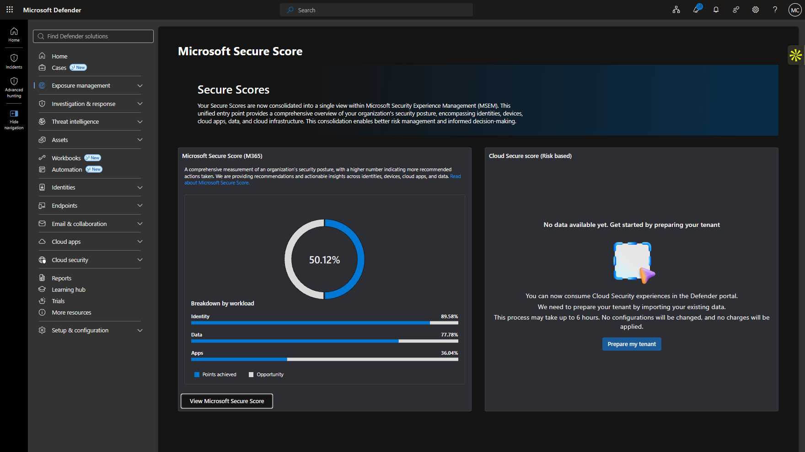

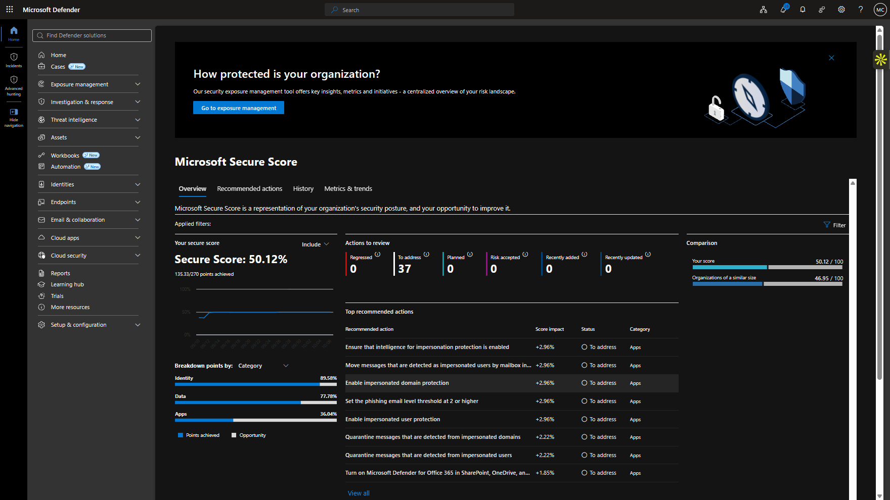

### Step 2 — Review recommended actions

The recommendation list highlighted remaining work in impersonation protection, anti-phishing configuration, auditing, and administrative privilege.

<strong>Portal procedure</strong>

**Navigation:** Microsoft Defender portal → Secure Score → Recommended actions

1. Open **Recommended actions**.
2. Sort or review the highest-value opportunities.
3. Open the impersonation-protection and anti-phishing recommendations.
4. Review the affected settings and point values.
5. Do not mark an action complete unless the underlying control is actually satisfied.

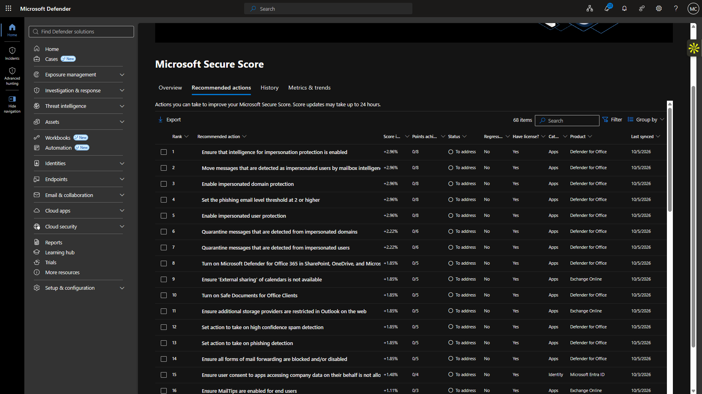

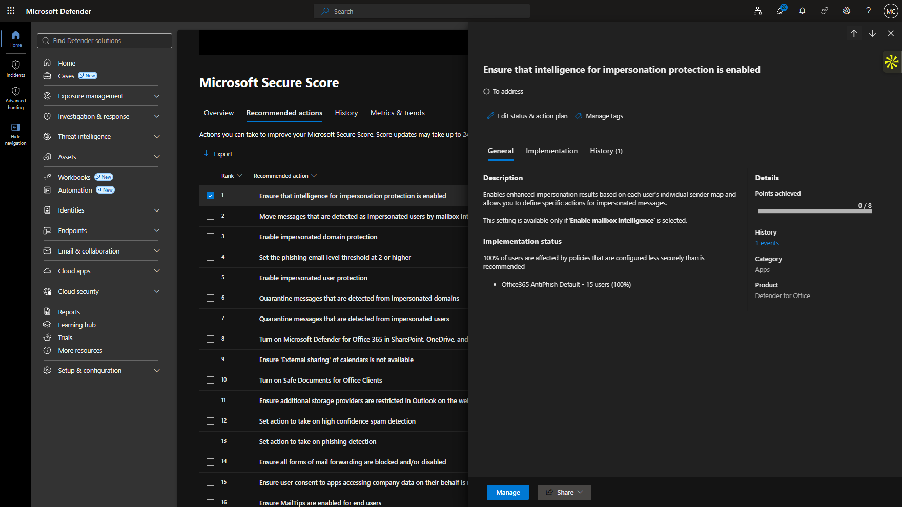

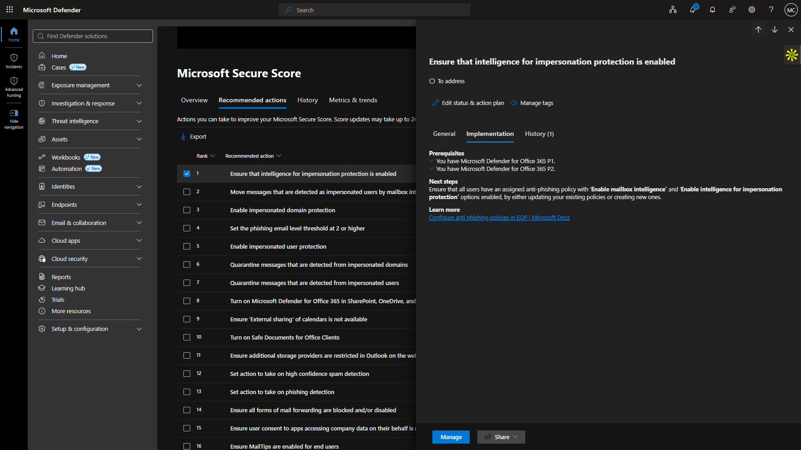

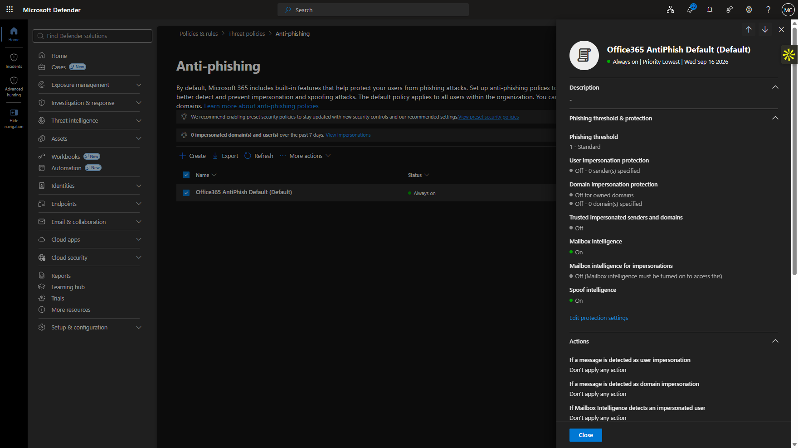

### Step 3 — Review completed MFA and email-protection controls

Secure Score credited completed controls for MFA, Safe Links, and Safe Attachments.

<strong>Portal procedure</strong>

**Navigation:** Microsoft Defender portal → Secure Score → Recommended actions → completed items

1. Open the completed MFA recommendation for administrators.
2. Review the credited Safe Links control.
3. Open the Safe Links detail.
4. Review the credited Safe Attachments control and its detail.
5. Confirm that the Secure Score credit corresponds to controls already validated elsewhere in the portfolio.

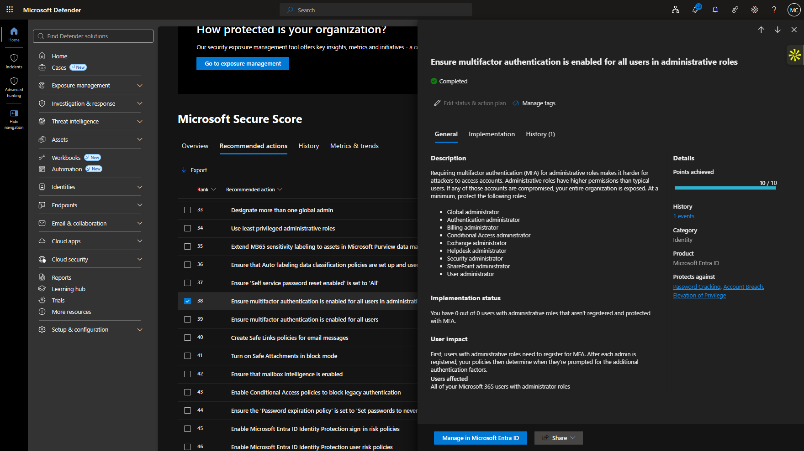

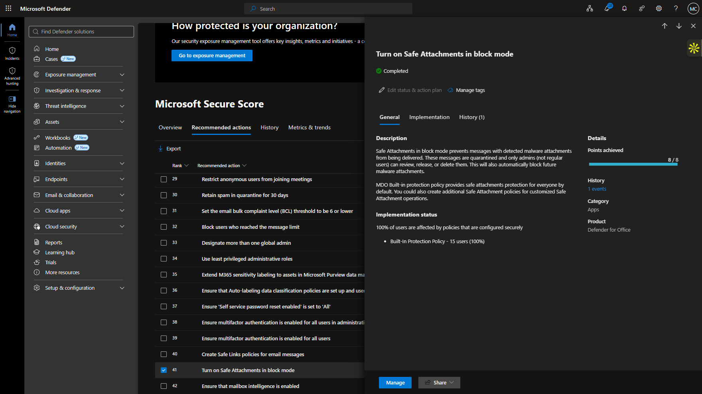

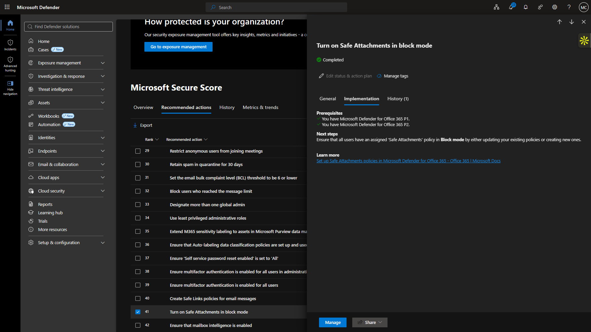

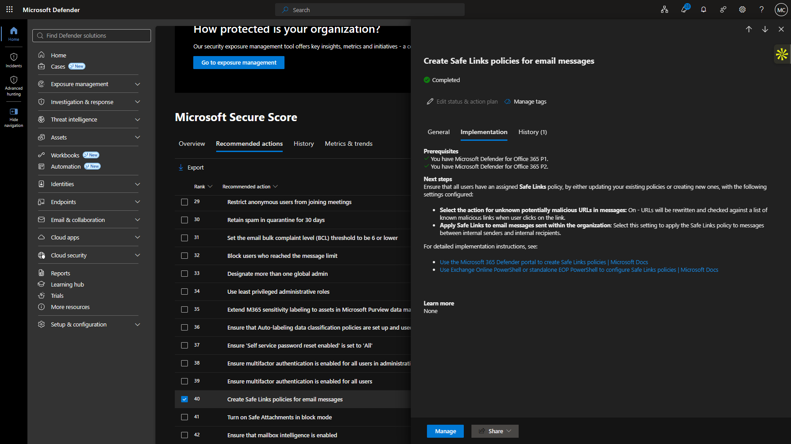

### Step 4 — Review identity and information-protection credit

Identity Protection, DLP, and sensitivity-label controls were also reflected in the score.

<strong>Portal procedure</strong>

**Navigation:** Microsoft Defender portal → Secure Score → completed Identity Protection / DLP / sensitivity items

1. Review completed Identity Protection recommendations for sign-in/user risk.
2. Open the DLP completed recommendation.
3. Open the sensitivity-label recommendation.
4. Compare the Secure Score credit with the corresponding Purview and Identity Protection project evidence.

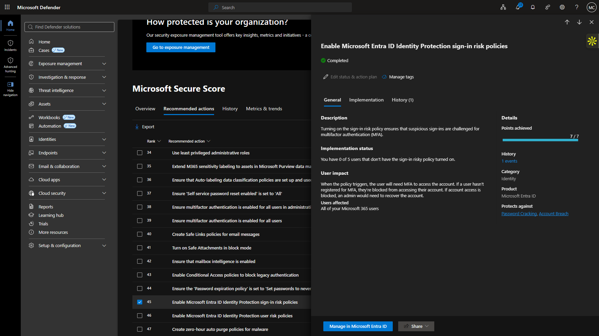

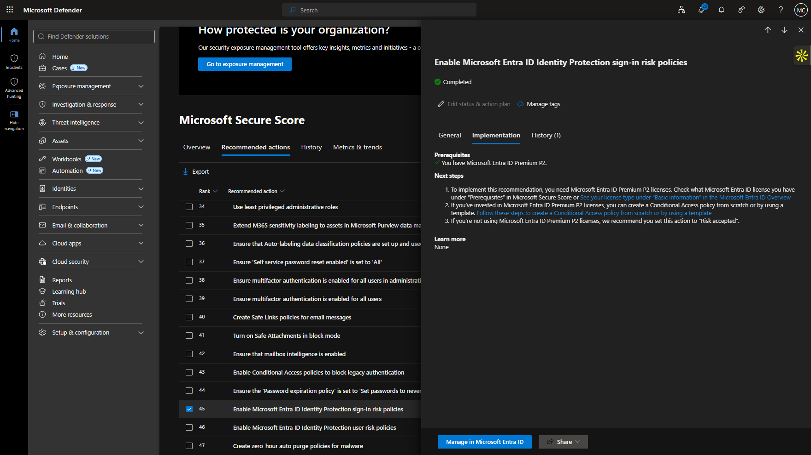

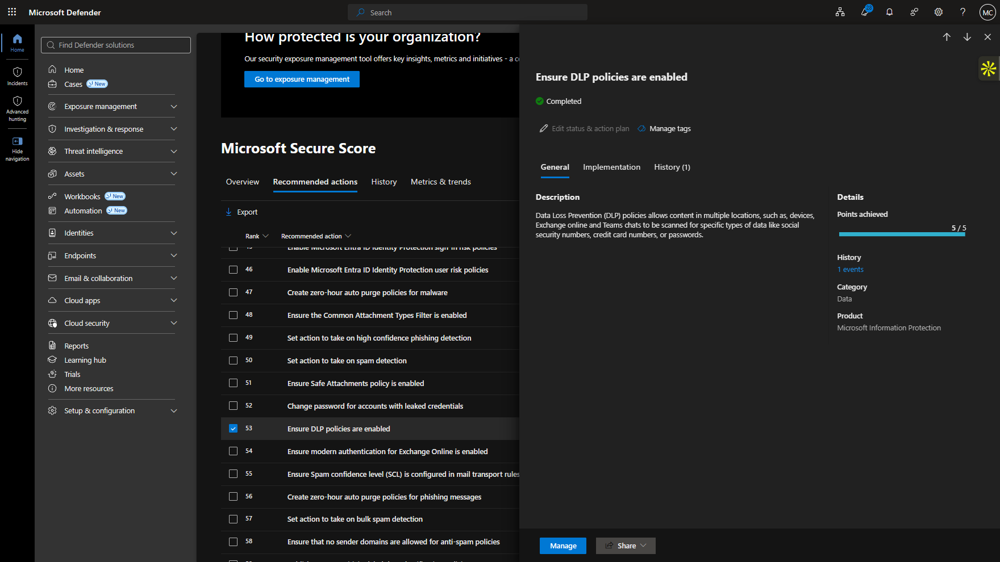

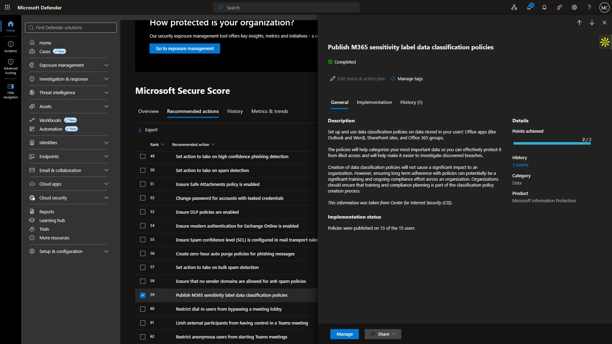

### Step 5 — Review remaining audit and least-privilege gaps

Audit and least-privileged administrative-role recommendations remained open and were reviewed rather than falsely marked complete.

<strong>Portal procedure</strong>

**Navigation:** Microsoft Defender portal → Secure Score → Recommended actions

1. Open the Microsoft 365 audit-log recommendation.
2. Confirm that the organizational audit setup state does not satisfy the recommendation.
3. Open the least-privileged administrative-role recommendation.
4. Review the detail and compare it with the tenant's actual standing administrator assignments.
5. Leave both items open if the underlying controls are not genuinely complete.

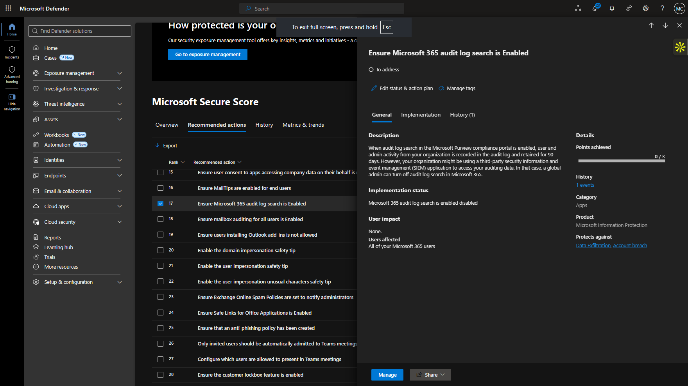

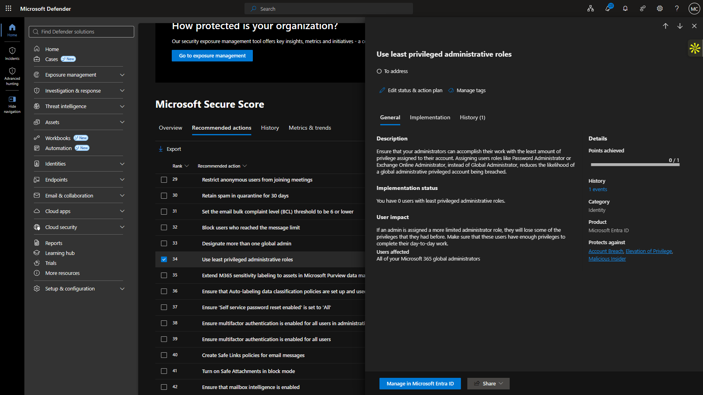

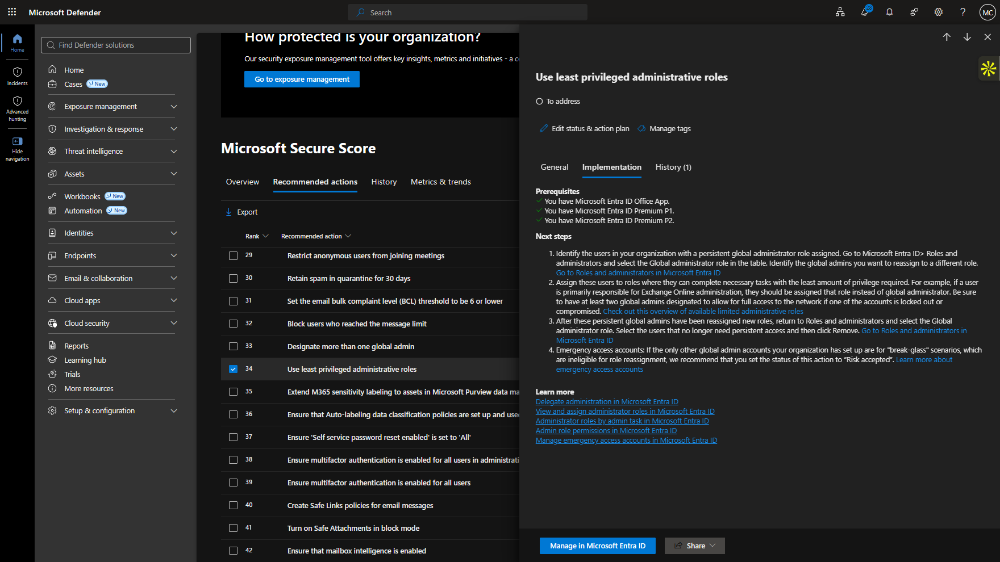

### Step 6 — Confirm the final score

A narrow mailbox-intelligence change was tested, but the portal required additional organizational setup and the change did not persist. The final score therefore remained unchanged.

<strong>Portal procedure</strong>

**Navigation:** Microsoft Defender portal → Secure Score → Overview

1. Return to the Secure Score overview after the review.
2. Refresh the score.
3. Confirm that the final score remains unchanged if no qualifying control was completed.
4. Record the final score and remaining action count as the closing posture for the project.

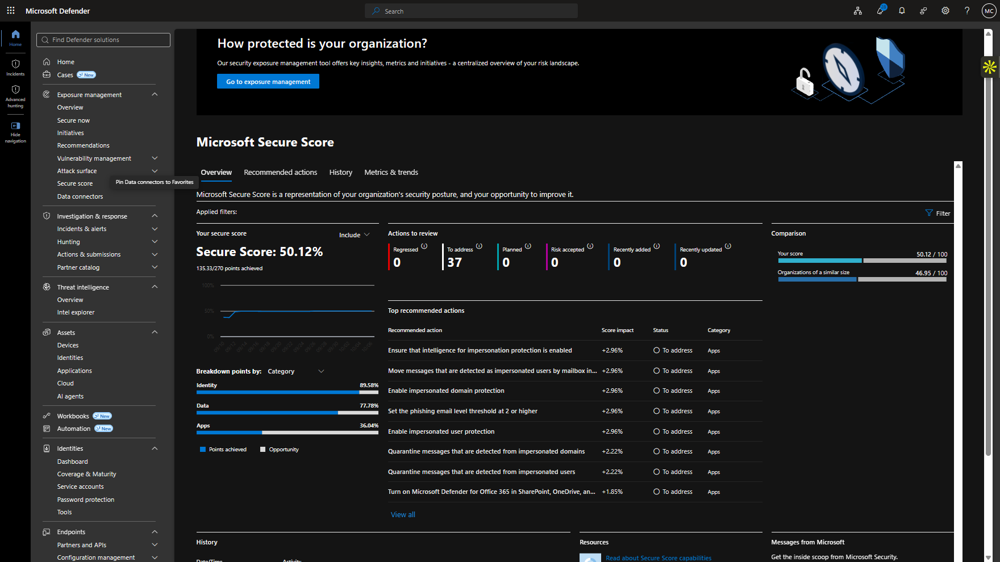

## Expected Outcome

Secure Score provides a truthful summary of completed security controls and remaining priorities, with no broad change made purely to improve the percentage.

## Validation

- Secure Score: 50.12% (135.33/270).
- 37 actions remained to address.
- MFA, Safe Links, Safe Attachments, DLP, sensitivity labels, and Identity Protection received credit.
- Impersonation protection, audit, and least-privilege items remained open where the tenant had not satisfied them.
- Final score remained unchanged after the review.

## Security Considerations

- Recommendations were reviewed in context rather than blindly enabled.
- A setting that required additional organizational setup was not forced.
- Open recommendations were left open when the underlying control was not genuinely satisfied.

## Common Issues and Troubleshooting

The attempted mailbox-intelligence adjustment did not persist because the portal required additional organizational setup. The change was abandoned and the final score was documented unchanged rather than treating the recommendation as completed.

## Key Takeaways

- Secure Score is most useful as a prioritization and review tool, not as a target number by itself.
- Completed controls should be tied back to real implementation evidence.
- An honest list of remaining gaps is more valuable than raising the score through poorly understood changes.
