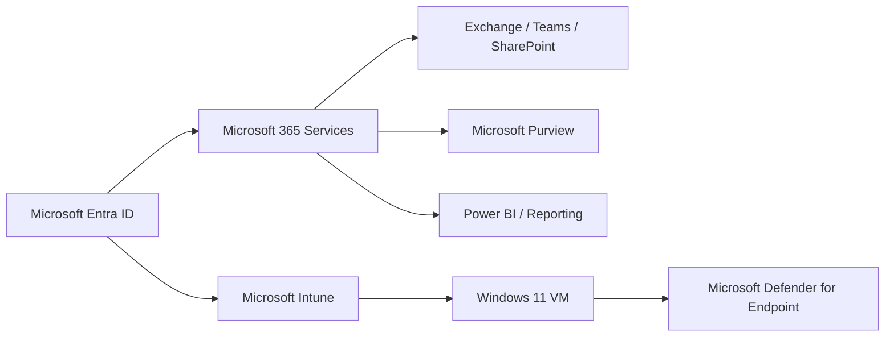

# Microsoft 365 Cybersecurity Portfolio

Email security, identity controls, data protection, endpoint security, authentication, and security-posture review.

## Portfolio Overview

This repository documents the Microsoft 365 environment for **Polaris Consulting Services** through a series of operational administration and support projects. The emphasis is on configuration that can be validated through user behavior, service telemetry, policy results, message trace, sign-in logs, endpoint reporting, and other native Microsoft 365 evidence.

The tenant users, service-desk records, payment-card test values, and business scenarios were created specifically for the lab environment.

## Environment at a Glance

- Microsoft 365 E5 / Office 365 E5 lab tenant
- Microsoft Entra ID
- Exchange Online
- Microsoft Teams
- SharePoint Online
- Microsoft Intune
- Microsoft Defender
- Microsoft Purview
- OneDrive for Business
- Power BI
- Windows 11 Pro VMware endpoint

## Projects

| Lab | Project | Primary focus |
|---|---|---|
| 07 | [Defender for Office 365](Lab-07-Defender-for-Office-365/README.md) | Email security, investigation |
| 08 | [Microsoft Purview DLP and Sensitivity Labels](Lab-08-Microsoft-Purview-DLP-and-Sensitivity-Labels/README.md) | DLP, sensitivity labels |
| 09 | [Conditional Access and Privileged Identity Management](Lab-09-Conditional-Access-and-Privileged-Identity-Management/README.md) | Conditional Access, PIM |
| 10 | [Intune Endpoint Management Baseline](Lab-10-Intune-Endpoint-Management-Baseline/README.md) | Intune policy baseline |
| 11 | [Intune Windows Endpoint Validation](Lab-11-Intune-Windows-Endpoint-Validation/README.md) | Windows enrollment, compliance |
| 13 | [SPF, DKIM, and DMARC](Lab-13-SPF-DKIM-and-DMARC/README.md) | SPF, DKIM, DMARC |
| 16 | [Microsoft Defender for Endpoint](Lab-16-Microsoft-Defender-for-Endpoint/README.md) | Defender for Endpoint |
| 17 | [Microsoft Entra Identity Protection](Lab-17-Microsoft-Entra-Identity-Protection/README.md) | Identity risk |
| 18 | [Microsoft Secure Score](Lab-18-Microsoft-Secure-Score/README.md) | Security posture assessment |

## Core Competencies

- Defender for Office 365 investigation
- Microsoft Purview DLP and sensitivity labels
- Conditional Access and privileged access review
- Intune security configuration and compliance
- SPF, DKIM, and DMARC
- Microsoft Defender for Endpoint onboarding and telemetry
- Entra Identity Protection
- Microsoft Secure Score assessment

## Administrative Approach

The projects are documented as progressive operational workflows rather than isolated configuration screenshots. Each lab records the scenario, objectives, tools, administrative steps, validation evidence, relevant security considerations, troubleshooting, and final operational takeaways.

Where a Microsoft service remained in report-only, simulation, propagation, or asynchronous processing state, the documented result reflects the actual state of the environment.

## Environment Flow



## Repository Structure

```text
Cybersecurity-Portfolio/
├── README.md
├── Lab-07-Defender-for-Office-365/
│   ├── README.md
│   └── screenshots/
├── Lab-08-Microsoft-Purview-DLP-and-Sensitivity-Labels/
│   ├── README.md
│   └── screenshots/
├── Lab-09-Conditional-Access-and-Privileged-Identity-Management/
│   ├── README.md
│   └── screenshots/
├── Lab-10-Intune-Endpoint-Management-Baseline/
│   ├── README.md
│   └── screenshots/
├── Lab-11-Intune-Windows-Endpoint-Validation/
│   ├── README.md
│   └── screenshots/
├── Lab-13-SPF-DKIM-and-DMARC/
│   ├── README.md
│   └── screenshots/
├── Lab-16-Microsoft-Defender-for-Endpoint/
│   ├── README.md
│   └── screenshots/
├── Lab-17-Microsoft-Entra-Identity-Protection/
│   ├── README.md
│   └── screenshots/
├── Lab-18-Microsoft-Secure-Score/
│   ├── README.md
│   └── screenshots/
```

## Evidence

Screenshots are placed beside the workflow step they support. Public copies were selected from the lab evidence pool, with sensitive identifiers removed or excluded where necessary.
